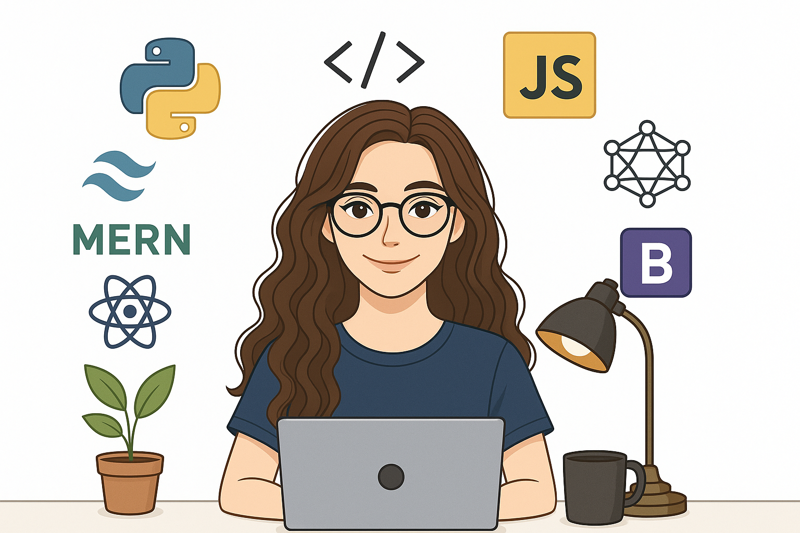

### Hi 👋, I'm Likitha
### Full-Stack Developer | SAP ABAP Developer | UI & Cybersecurity Enthusiast

### About Me

- 🔭 Currently building **full-stack apps, SAP-based tools, UI experiments**
- 🌱 Learning **React, Supabase, Go, Cybersecurity tools, AI APIs**
- 🛠 Certified by **Microsoft, IBM, Harvard, LinkedIn, FreeCodeCamp**
- 🏆 Achievements: **GAIT Bronze**, 5★ on **Python, Java, Problem Solving @ HackerRank**
- 📫 Reach me at **likhitha.desala@gmail.com**
- ⚡ Fun fact: *I once fixed a bug by taking a nap!*

###  Connect with Me

### Languages & Tools

  <!-- Programming Languages -->
  
  
  
  

  <!-- Web Development -->
  
  
  
  
  
  

  <!-- Backend & Databases -->
  
  
  
  

  <!-- Tools -->
  
  
  

###  GitHub Stats

###  GitHub Streak

###  Top Languages

###  GitHub Achievements

###  Activity Graph

### 💬 Favorite Quote

> “Code is like humor. When you have to explain it, it’s bad.” – *Cory House*
