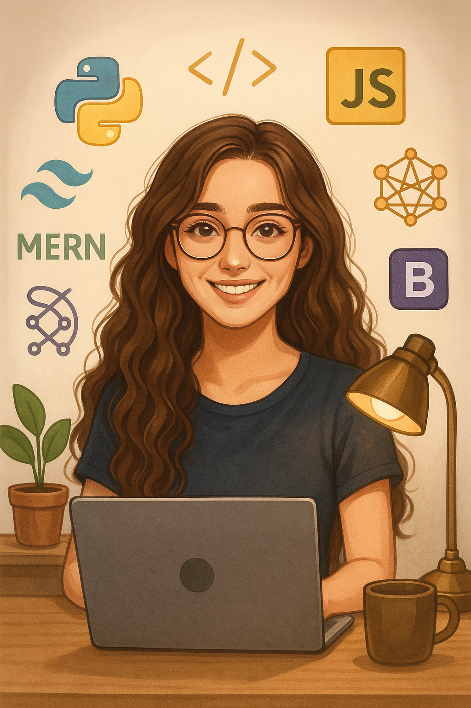

<h1 align="center">Hi there 👋, I'm Likitha</h1>
<h3 align="center">Full-Stack Developer | SAP ABAP Developer | UI & Cybersecurity Enthusiast</h3>

  

  

---

### 🌟 About Me

I'm Likitha, a passionate full-stack developer with hands-on experience in **SAP ABAP** and frontend/backend web development. I love building clean UIs, experimenting with parallax/3D effects, and exploring backend technologies and cybersecurity. I’m committed to shipping real, useful projects.

- 🔭 Currently building: Full-stack apps, SAP-based tools, UI projects  
- 🌱 Learning: React, Next.js, Supabase, Go, Cybersecurity tools, AI APIs  
- 🛠 Certified by: Microsoft, IBM, Harvard, LinkedIn, FreeCodeCamp  
- 🏆 Achievements: GAIT Bronze | 5★ Python, Java, Problem Solving on HackerRank  
- 📫 Reach me at: likhitha.desala@gmail.com 
- ⚡ Fun fact: I mix design and code to make even enterprise apps beautiful ✨

---

### 🛠️ Skills & Tools

  
  
  
  
  
  
  
  
  
  
  
  
  
  
  
  
  
  
  
  

---

### 📊 GitHub Stats

  

---

### 🔥 GitHub Streak

  

---

### 🏆 GitHub Achievements

  

---

### 💬 Favorite Quote

> "Code is like humor. When you have to explain it, it’s bad." – Cory House
